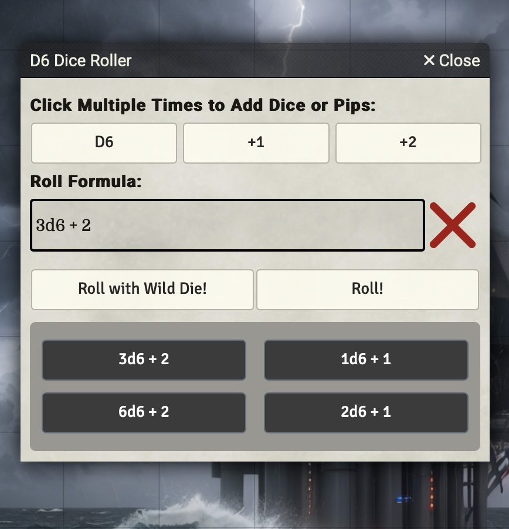
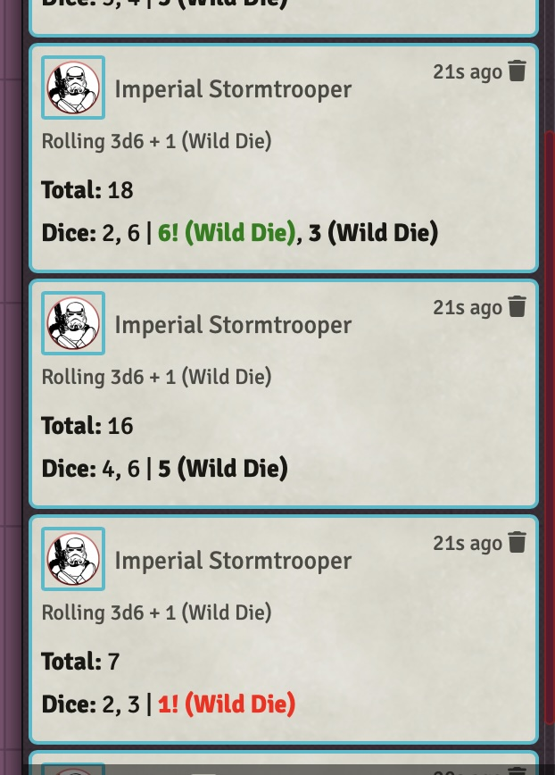

# D6-dice-roller Macro
For FoundryVTT. Easily roll dice with a wild die, keep a history of dice rolled. Copy the contents of the D6-dice-roller text file to a Foundry Script-based Macro.

 

Kudos and thanks to the unmodified orginal, found here: https://github.com/Cryptocartographer/Dice-Roller 

